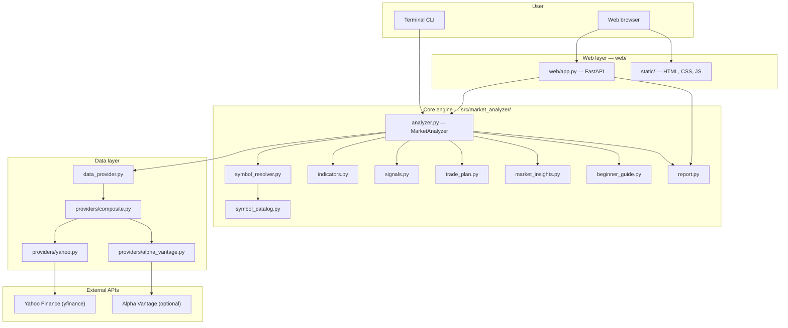
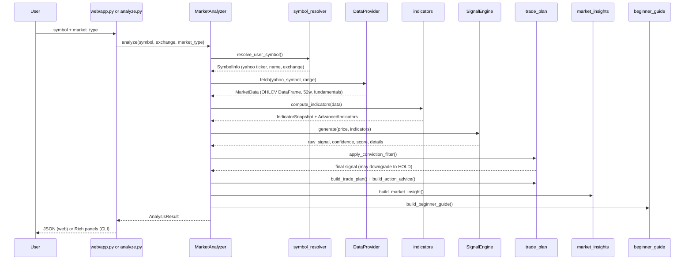
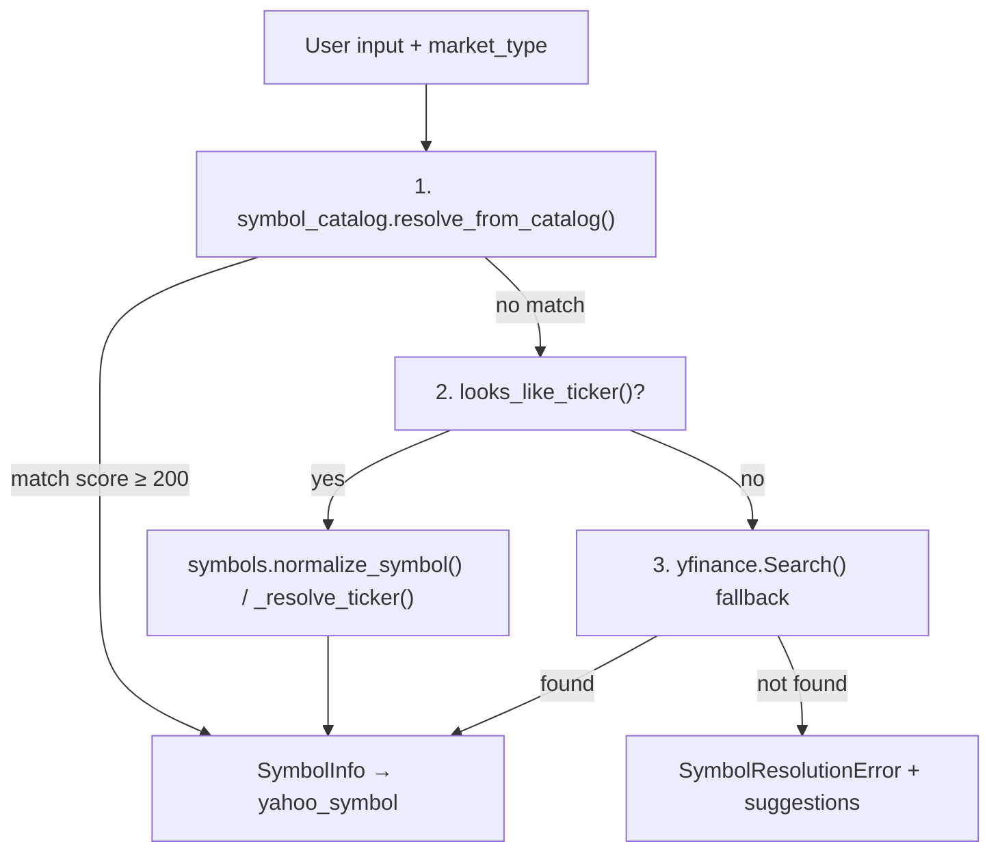
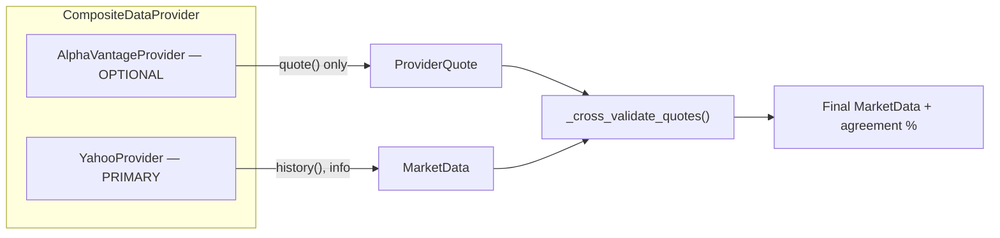
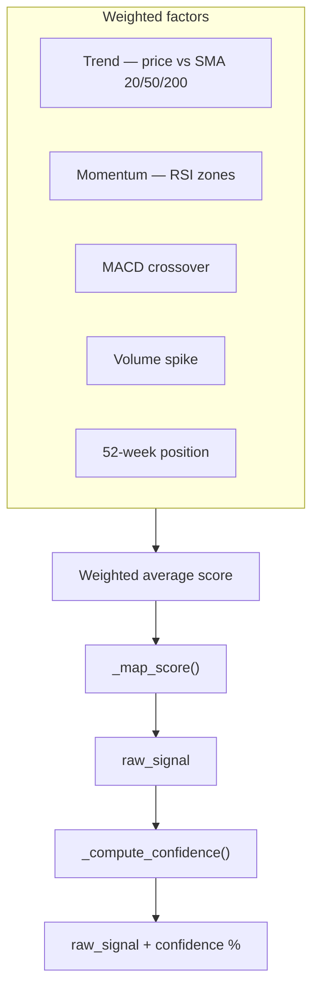
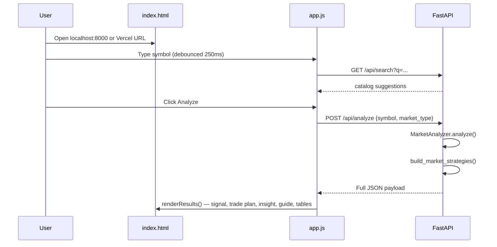

# Market Analyzer By Saksham — How It Works

This document explains **what the app does**, **where data comes from**, **how analysis is built**, and **how the pieces connect**.  
Educational use only — not investment advice.

---

## Table of contents

1. [What is this app?](#1-what-is-this-app)
2. [High-level architecture](#2-high-level-architecture)
3. [Project structure](#3-project-structure)
4. [End-to-end data flow](#4-end-to-end-data-flow)
5. [Symbol resolution (name → ticker)](#5-symbol-resolution-name--ticker)
6. [Data providers (where prices come from)](#6-data-providers-where-prices-come-from)
7. [Technical indicators](#7-technical-indicators)
8. [Signal engine (buy / sell / hold)](#8-signal-engine-buy--sell--hold)
9. [Conviction filter & trade plan](#9-conviction-filter--trade-plan)
10. [Market insights & strategies](#10-market-insights--strategies)
11. [Beginner guide (English + Hinglish)](#11-beginner-guide-english--hinglish)
12. [Web UI flow](#12-web-ui-flow)
13. [CLI flow](#13-cli-flow)
14. [API reference](#14-api-reference)
15. [Configuration & environment variables](#15-configuration--environment-variables)
16. [Deployment (local, Vercel)](#16-deployment-local-vercel)
17. [Limitations & disclaimers](#17-limitations--disclaimers)

---

## 1. What is this app?

**Market Analyzer** is a personal market analysis tool that:

| Capability | Description |
|------------|-------------|
| **Markets** | India (NSE/BSE indices, stocks, ETFs), US stocks/ETFs/indices, global indices |
| **Search** | Type a **ticker or full name** (e.g. `UTI Gold ETF`, `AAPL`, `NIFTY`) |
| **Analysis** | Technical indicators, regime detection, support/resistance |
| **Signals** | `STRONG_BUY`, `BUY`, `HOLD`, `SELL`, `STRONG_SELL` with confidence % |
| **Trade plan** | Entry zone, stop-loss, targets, risk/reward ratio |
| **Guidance** | Plain-language action advice + collapsible beginner breakdown (English/Hinglish) |
| **Interfaces** | Web dashboard + CLI |

It does **not** place trades, manage portfolios, or read broker accounts. It fetches public market data, runs math on price history, and returns a structured report.

---

## 2. High-level architecture



---

## 3. Project structure

```
market-analyzer/
├── analyze.py                 # CLI entry point
├── main.py                    # Vercel serverless entry (imports web.app)
├── run_web.sh                 # Local dev: uvicorn on port 8000
├── config.example.yaml        # Watchlist + signal thresholds (CLI)
├── requirements.txt           # Python dependencies
├── vercel.json                # Vercel deploy config (60s timeout)
├── HOW_IT_WORKS.md            # This file
├── README.md                  # Quick start guide
│
├── web/
│   ├── app.py                 # FastAPI routes + static files
│   └── static/
│       ├── index.html         # Dashboard UI
│       ├── app.js             # Fetch API, render results
│       └── styles.css         # Layout + mobile responsive styles
│
├── src/market_analyzer/
│   ├── analyzer.py            # Main orchestrator
│   ├── models.py              # Signal, Exchange, AnalysisResult, etc.
│   ├── symbol_resolver.py     # Name/ticker → SymbolInfo
│   ├── symbol_catalog.py      # Searchable instrument catalog
│   ├── symbols.py             # Index aliases (NIFTY → ^NSEI)
│   ├── data_provider.py       # Facade over composite provider
│   ├── providers/
│   │   ├── base.py            # MarketData, protocols
│   │   ├── yahoo.py           # Primary OHLCV + fundamentals
│   │   ├── alpha_vantage.py   # Optional US quote validation
│   │   └── composite.py       # Merges providers
│   ├── indicators.py          # SMA, RSI, MACD, ATR, regime, S/R
│   ├── signals.py             # Weighted signal scoring
│   ├── trade_plan.py          # Entry/stop/targets + conviction filter
│   ├── market_insights.py     # Thesis, regime, provider summary
│   ├── beginner_guide.py      # English + Hinglish explanations
│   ├── strategies.py          # Contextual strategy cards (web only)
│   └── report.py              # CLI Rich output + JSON serialization
│
└── tests/
    ├── test_market_analyzer.py
    └── test_beginner_guide.py
```

---

## 4. End-to-end data flow

When you analyze a symbol, this is the exact pipeline inside `MarketAnalyzer.analyze()` (`analyzer.py`):



### `AnalysisResult` contains

| Field | Source |
|-------|--------|
| `symbol` | Symbol resolver |
| `price`, `volume`, `day_change_pct` | Latest bar from Yahoo |
| `fifty_two_week_high/low` | Yahoo ticker info |
| `indicators` | `compute_indicators()` |
| `signal`, `raw_signal`, `confidence`, `score` | Signal engine + conviction filter |
| `signal_details` | Per-factor breakdown |
| `trade_plan` | Entry, stop, targets, R:R |
| `action_advice` | Plain-language next step |
| `market_insight` | Regime, thesis, support/resistance |
| `risks` | Auto-generated risk flags |
| `summary` | One-line summary |
| `beginner_guide` | `{ english, hinglish }` objects |
| `recent_bars` | Last 10 OHLCV sessions |

---

## 5. Symbol resolution (name → ticker)

Users can type **tickers** (`TATAGOLD`) or **full names** (`UTI Gold Exchange Traded Fund`). Resolution is handled by `resolve_user_symbol()` in `symbol_resolver.py`.



### Market types → exchange hint

| `market_type` | Exchange | Example input | Resolved Yahoo symbol |
|---------------|----------|---------------|------------------------|
| `index` | INDEX | `NIFTY` | `^NSEI` |
| `nse_stock` | NSE | `RELIANCE` | `RELIANCE.NS` |
| `bse_stock` | BSE | `500325` | `500325.BO` |
| `etf` | NSE | `TATAGOLD` | `TATAGOLD.NS` |
| `us_stock` | US | `AAPL` | `AAPL` |
| `us_etf` | US | `SPY` | `SPY` |
| `us_index` | US | `S&P 500` | `^GSPC` |
| `global_index` | INDEX | `^FTSE` | `^FTSE` |

### Catalog (`symbol_catalog.py`)

- Hardcoded entries for common India/US instruments with **aliases** (e.g. UTI Gold → `GOLDBETA`)
- `search_catalog(query)` powers web autocomplete (`GET /api/search`)
- Fuzzy scoring on name, symbol, and aliases

---

## 6. Data providers (where prices come from)



### Yahoo Finance (always on)

- **Library:** `yfinance`
- **File:** `providers/yahoo.py`
- **Fetches:** Daily OHLCV history, current price, volume, 52-week high/low, currency, basic fundamentals (sector, market cap, etc.)
- **Used for:** All markets (India, US, global)

### Alpha Vantage (optional)

- **Env var:** `ALPHA_VANTAGE_API_KEY`
- **File:** `providers/alpha_vantage.py`
- **Fetches:** Live quote for cross-validation
- **Scope:** US stocks/ETFs and `^` indices only — **not** India NSE/BSE symbols
- **Purpose:** Compare Yahoo price vs AV price → `quote_agreement_pct` in market insight

### Cache (serverless)

On Vercel/serverless, `web/app.py` sets:

```
YFINANCE_CACHE_DIR=/tmp/py-yfinance
```

so yfinance can write its SQLite cache to a writable temp directory.

---

## 7. Technical indicators

Computed in `compute_indicators()` (`indicators.py`) from the OHLCV DataFrame.

| Indicator | Period / method | Used for |
|-----------|-----------------|----------|
| **SMA 20, 50, 200** | Simple moving average | Trend direction |
| **RSI 14** | Relative Strength Index | Overbought (>70) / oversold (<30) |
| **MACD** | 12/26/9 EMA crossover | Momentum |
| **ATR 14** | Average True Range | Volatility, stop-loss sizing |
| **Bollinger Bands** | 20-period, 2σ | Volatility context |
| **Volume ratio** | Today vs 20-day avg | Participation confirmation |
| **52-week position** | % from high/low | Extension / value zone |
| **1M / 3M returns** | Price change % | Recent momentum |
| **Support / Resistance** | 20-bar low/high | Key levels in insight |
| **Regime** | Trend + ATR | `trending_up`, `trending_down`, `ranging`, `volatile` |

---

## 8. Signal engine (buy / sell / hold)

`SignalEngine.generate()` in `signals.py` scores multiple factors, then maps to a signal.



### Score → signal mapping

| Normalized score | Signal |
|------------------|--------|
| ≥ 2.0 | `STRONG_BUY` |
| ≥ 0.75 | `BUY` |
| ≤ -2.0 | `STRONG_SELL` |
| ≤ -0.75 | `SELL` |
| else | `HOLD` |

### Default thresholds (`SignalConfig`)

| Setting | Default | Meaning |
|---------|---------|---------|
| `rsi_oversold` | 30 | RSI below → bullish factor |
| `rsi_overbought` | 70 | RSI above → bearish factor |
| `volume_spike_multiplier` | 1.5 | Volume ≥ 1.5× avg → bullish |
| `min_confidence` | 50 | Below this → signal downgraded to HOLD |

### Confidence

- Measures how much factors **agree** with the direction
- Blend of factor agreement (55%) + score magnitude (45%)
- Shown in UI as a percentage; used by conviction filter

---

## 9. Conviction filter & trade plan

### Conviction filter (`apply_conviction_filter()`)

If raw signal is `BUY`/`SELL`/`STRONG_*` but **confidence < min_confidence (50%)**:

- Final signal → **HOLD**
- `conviction_met = false`
- Prevents acting on weak/mixed setups

### Trade plan (`build_trade_plan()`)

| Level | How it's calculated |
|-------|---------------------|
| **Entry zone** | Near support / SMA with small buffer |
| **Stop-loss** | Below recent swing low or ATR-based |
| **Target 1** | Near resistance or measured move |
| **Target 2** | Extended target |
| **Risk/reward** | (Target − Entry) / (Entry − Stop) |

### Action advice (`build_action_advice()`)

Human-readable line based on signal + RSI + conviction, e.g.:

- *"Buy on dips — place limit orders inside the entry zone"*
- *"Wait for dip — do not chase; price is overbought"*
- *"Stay on sidelines — mixed signals"*

---

## 10. Market insights & strategies

### Market insight (`market_insights.py`)

Built after indicators and signal. Includes:

- **Regime** — trending up/down, ranging, volatile
- **Trend strength** — 0–100%
- **Support / resistance** — from recent price action
- **Thesis** — one paragraph plain-English read (uses sector/fundamentals when available)
- **Provider summary** — which data sources were used + price agreement %

### Market strategies (`strategies.py`) — web only

Extra cards added in `web/app.py` after analysis, e.g.:

- Wait for dip
- Breakout watch
- Index neutral
- Avoid chase

These are **contextual suggestions**, not separate trading systems.

---

## 11. Beginner guide (English + Hinglish)

`build_beginner_guide()` in `beginner_guide.py` turns the `AnalysisResult` into two language packs:

```json
{
  "english": { "verdict", "why_yes", "why_no", "checklist", ... },
  "hinglish": { "verdict", "why_yes", "why_no", "checklist", ... }
}
```

| Section | What it explains |
|---------|------------------|
| **Verdict** | Wait / consider buy / avoid — headline + summary |
| **Looks good / Watch out for** | Pros and cons from real indicators |
| **Quick checklist** | Pass / warn / fail items before buying |
| **The signal** | What HOLD/BUY/SELL means for this symbol |
| **In short** | Thesis + action advice |
| **Price levels** | Entry, stop, targets in plain words |
| **Risks / Next steps** | What to do now |
| **Glossary** | RSI, MACD, stop-loss, etc. |

In the **web UI**, this section is **collapsed by default** — user expands **"Simple breakdown"** and can switch **English / Hinglish** tabs.

---

## 12. Web UI flow



### UI sections (top to bottom)

1. Search bar — market type + symbol + autocomplete  
2. Hero — name, price, day change  
3. Signal + Action advice  
4. Simple breakdown (collapsible beginner guide)  
5. Trade plan  
6. Market insight  
7. Market strategies  
8. Key metrics + Risk flags  
9. Signal breakdown table  
10. Recent sessions table  

Frontend files:

- `web/static/index.html` — structure  
- `web/static/app.js` — API calls + DOM rendering  
- `web/static/styles.css` — dark theme + mobile breakpoints (≤768px)  

---

## 13. CLI flow

```bash
# Single symbol
python analyze.py TATAGOLD --market-type etf

# By full name
python analyze.py "UTI Gold Exchange Traded Fund" --market-type etf

# US stock
python analyze.py AAPL --market-type us_stock

# JSON export
python analyze.py NIFTY --market-type index --json output/nifty.json

# Watchlist from config
python analyze.py --watchlist --config config.yaml
```

CLI uses `report.render_analysis()` for colored terminal panels (including compact beginner guide).  
Same `MarketAnalyzer.analyze()` as the web — **no** `market_strategies` in CLI output.

---

## 14. API reference

| Method | Path | Description |
|--------|------|-------------|
| `GET` | `/` | Serves dashboard HTML |
| `GET` | `/static/*` | CSS, JS assets |
| `GET` | `/api/health` | Status + supported market types |
| `GET` | `/api/search?q=&market_type=` | Autocomplete (max 8 results) |
| `POST` | `/api/analyze` | Full analysis JSON |

### `POST /api/analyze` body

```json
{
  "symbol": "RELIANCE",
  "market_type": "nse_stock"
}
```

### Success response (simplified)

```json
{
  "symbol": { "input": "RELIANCE", "yahoo": "RELIANCE.NS", "exchange": "NSE", "name": "Reliance Industries" },
  "price": 2450.0,
  "signal": "HOLD",
  "raw_signal": "BUY",
  "confidence": 42,
  "conviction_met": false,
  "action_advice": "Stay on sidelines — mixed signals",
  "trade_plan": { "entry_low": 2400, "entry_high": 2430, "stop_loss": 2350, "target_1": 2550, "target_2": 2620, "risk_reward_ratio": 2.1 },
  "market_insight": { "regime": "trending_up", "thesis": "...", "provider_summary": "..." },
  "market_strategies": [ { "id": "wait_for_dip", "title": "...", "suitability": "high" } ],
  "beginner_guide": { "english": { ... }, "hinglish": { ... } },
  "indicators": { ... },
  "signal_details": [ ... ],
  "recent_bars": [ ... ],
  "risks": [ ... ]
}
```

### Error responses

| Code | When |
|------|------|
| `400` | Bad market type, empty symbol, unknown symbol (with `suggestions`) |
| `502` | Yahoo/data fetch failed |

---

## 15. Configuration & environment variables

### Environment variables

| Variable | Required | Purpose |
|----------|----------|---------|
| `ALPHA_VANTAGE_API_KEY` | No | Enable US quote cross-validation |
| `YFINANCE_CACHE_DIR` | No | Writable cache path (default `/tmp/py-yfinance` on serverless) |

### YAML config (`config.example.yaml`) — CLI only

```yaml
defaults:
  history_range: 6mo
signals:
  rsi_oversold: 30
  rsi_overbought: 70
  min_confidence: 50
watchlist:
  indices: [NIFTY, BANKNIFTY]
  stocks: [RELIANCE, TCS]
  etfs: [TATAGOLD]
```

Web UI uses fixed defaults (`6mo` history, default signal thresholds) — no YAML loading.

---

## 16. Deployment (local, Vercel)

### Local

```bash
cd market-analyzer
source .venv/bin/activate
pip install -r requirements.txt
./run_web.sh
# → http://localhost:8000
```

`run_web.sh` runs:

```
PYTHONPATH=src uvicorn web.app:app --reload --host 0.0.0.0 --port 8000
```

### Vercel (free tier)

| File | Role |
|------|------|
| `main.py` | Serverless entry — `from web.app import app` |
| `vercel.json` | `maxDuration: 60` for analysis |
| `requirements.txt` | Python dependencies at build time |

Steps: push to GitHub → import on [vercel.com](https://vercel.com) → deploy.  
Vercel auto-detects FastAPI via `main.py`.

---

## 17. Limitations & disclaimers

| Topic | Reality |
|-------|---------|
| **Not advice** | Educational analysis only; not SEBI-registered research |
| **Data delays** | Yahoo Finance may lag real-time exchange feeds |
| **No fundamentals deep-dive** | Light sector/market cap info only — not full financial statements |
| **Technical only** | Does not read news, earnings calls, or macro events unless reflected in price |
| **Past ≠ future** | Signals are based on historical patterns |
| **India AV gap** | Alpha Vantage does not cover NSE/BSE — Yahoo only for India |
| **Cold starts** | Free Vercel/Render tiers may slow first request after idle |

Always do your own research. Only invest money you can afford to lose.

---

## Quick reference — key functions

| Step | Function | File |
|------|----------|------|
| Resolve symbol | `resolve_user_symbol()` | `symbol_resolver.py` |
| Search autocomplete | `search_catalog()` | `symbol_catalog.py` |
| Fetch prices | `DataProvider.fetch()` | `data_provider.py` |
| Merge providers | `CompositeDataProvider.fetch()` | `providers/composite.py` |
| Indicators | `compute_indicators()` | `indicators.py` |
| Signal | `SignalEngine.generate()` | `signals.py` |
| Conviction | `apply_conviction_filter()` | `trade_plan.py` |
| Trade plan | `build_trade_plan()` | `trade_plan.py` |
| Insight | `build_market_insight()` | `market_insights.py` |
| Beginner guide | `build_beginner_guide()` | `beginner_guide.py` |
| Strategies | `build_market_strategies()` | `strategies.py` |
| JSON export | `analysis_to_dict()` | `report.py` |
| Orchestrate all | `MarketAnalyzer.analyze()` | `analyzer.py` |

---

*Market Analyzer By Saksham — built for learning and personal research.*
