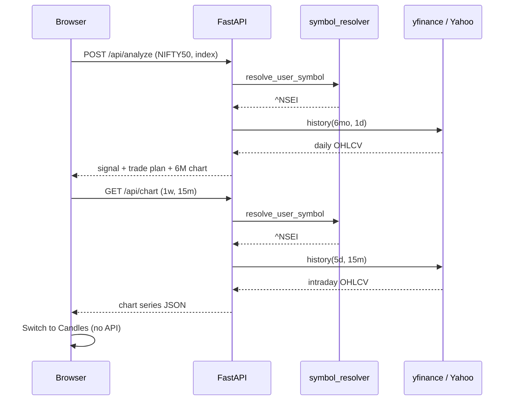

# Market Analyzer.

Worldwide-ready market analysis for **India (NSE/BSE)**, **US stocks/ETFs**, and **global indices** — with buy/sell signals, trade plans, market insight thesis, and multi-provider data.

📖 **[How it works — full architecture & diagrams](HOW_IT_WORKS.md)**

## What makes this different from generic apps

| Generic apps | Market Analyzer |
|--------------|-----------------|
| Ticker-only search | **Name or ticker** — type "UTI Gold ETF" and it resolves to `GOLDBETA` |
| Single data feed | **Multi-provider** — Yahoo + optional Alpha Vantage cross-validation |
| RSI/MACD only | **Regime detection** — trending / ranging / volatile + support/resistance |
| Raw numbers | **Institutional-style thesis** — plain-English market read with fundamentals |
| No trade plan | **Entry zone, stop-loss, targets**, risk/reward, conviction filter |
| No strategy context | **Market strategies** — wait for dip, breakout, index neutral, etc. |

## Quick start (CLI)

```bash
cd ~/Desktop/MAIN/market-analyzer
source .venv/bin/activate
pip install -r requirements.txt

# India — by ticker or name
python analyze.py TATAGOLD --market-type etf
python analyze.py "UTI Gold Exchange Traded Fund" --market-type etf

# US markets
python analyze.py AAPL --market-type us_stock
python analyze.py "S&P 500" --market-type us_index

# India index
python analyze.py NIFTY --market-type index
```

## Web UI

```bash
./run_web.sh
# Open http://localhost:8000
```

- Select market region (India / US / Global)
- Type **symbol or full name** — autocomplete suggestions appear
- One screen: signal, action, trade plan, market insight, strategies
- **Beginner Guide** — collapsible plain-language section (English + **Hinglish** tabs): verdict, checklist, signal explained, risks, next steps, glossary
- **Paper Trade** (`/trade`) — Nifty 50 options simulator with ₹1,00,000 fake wallet, option chain (NSE), market buy/sell, partial exit, mark-to-market P&amp;L (stored in browser `localStorage`)

## Deploy free on Vercel

Yes — this app works on **Vercel’s free Hobby plan** (FastAPI is supported natively).

### Steps

1. Push the repo to GitHub:
   ```bash
   cd ~/Desktop/MAIN/market-analyzer
   git init
   git add .
   git commit -m "Market Analyzer By Saksham"
   # create repo on GitHub, then:
   git remote add origin https://github.com/YOUR_USERNAME/market-analyzer.git
   git push -u origin main
   ```

2. Go to [vercel.com/new](https://vercel.com/new) → **Import** your GitHub repo.

3. Vercel auto-detects FastAPI via root **`app.py`** (not `web/app.py`). No custom build command needed.

4. (Optional) Add environment variables in Vercel → **Settings → Environment Variables**:
   - `ALPHA_VANTAGE_API_KEY` — US stock cross-validation
   - `YFINANCE_CACHE_DIR` — defaults to `/tmp/py-yfinance` on serverless

5. Click **Deploy**. You’ll get a URL like `https://market-analyzer-xxxx.vercel.app`.

### Notes

| Topic | Detail |
|-------|--------|
| **Cost** | Free on Hobby (good for personal use) |
| **Cold start** | First request after idle may take a few seconds |
| **Timeout** | `vercel.json` sets 60s max for analysis (enough for yfinance) |
| **Static UI** | Served by FastAPI (`/` + `/static/*`) — no separate frontend deploy |
| **Alternative** | [Render](https://render.com) is also free and keeps a long-running server (fewer cold starts) |

Local Vercel preview (requires [Vercel CLI](https://vercel.com/docs/cli) 48.1.8+):

```bash
npm i -g vercel
vercel dev
```

## Beginner Guide

Every analysis includes a personalized `beginner_guide` field — not generic boilerplate. It is generated from the actual `AnalysisResult` (signal, trade plan, market insight, risks).

| Section | What it explains |
|---------|------------------|
| **Verdict** | Should you invest or wait? Plain headline + summary |
| **Why yes / Why no** | Personalized pros and cons from indicators |
| **Checklist** | Pass/warn/fail items before buying |
| **Signal explained** | What HOLD / BUY / SELL means for beginners |
| **Analysis in plain terms** | Thesis + action advice in simple language |
| **Key levels** | Entry zone, stop-loss, targets explained |
| **Risks** | Technical risks + general warnings |
| **Next steps** | Step-by-step actions based on current signal |
| **Glossary** | RSI, MACD, stop-loss, entry zone, etc. |

The CLI prints compact Beginner Guide panels for English and Hinglish. The web UI shows the full collapsible card with **English / Hinglish** tabs. JSON/CLI output includes both under `beginner_guide.english` and `beginner_guide.hinglish`.

```bash
# Example: export with beginner guide
python analyze.py TATAGOLD --market-type etf --json output/tatagold.json
```

## Multi-provider setup (optional)

Yahoo Finance works out of the box. For US stock **price cross-validation**, set:

```bash
export ALPHA_VANTAGE_API_KEY=your_key_here
```

Free key: https://www.alphavantage.co/support/#api-key

When configured, the report shows provider agreement % in Market Insight.

## How data is fetched

End-to-end flow from browser to Yahoo Finance and back. There is **no database** — each request pulls live market data.

```
Browser (app.js)
    → FastAPI (web/app.py)
    → Symbol resolution (symbol_resolver.py)
    → Data fetch (DataProvider / YahooProvider / optional Alpha Vantage)
    → Indicators + signals + chart formatting
    → JSON response to UI
```

### Data sources

| What | Source | Library / API |
|------|--------|----------------|
| Price history (analysis) | Yahoo Finance | `yfinance` `Ticker.history()` |
| Price history (charts) | Yahoo Finance | Same, with custom period/interval |
| Symbol metadata | Yahoo Finance | `ticker.info`, `fast_info` |
| Symbol search (names) | Yahoo Finance | `yfinance.Search()` |
| Symbol catalog | Local Python | No network |
| Optional price validation | Alpha Vantage | REST API (`ALPHA_VANTAGE_API_KEY`) |

**Primary path:** `YahooProvider` in `src/market_analyzer/providers/yahoo.py` calls `yf.Ticker(symbol).history(period=..., interval=...)`.

**Analysis** uses `CompositeDataProvider` (Yahoo primary + optional Alpha Vantage quote cross-check). **Charts** call `YahooProvider` directly via `fetch_chart_data()` in `chart_data.py`.

### Example walkthrough: Nifty50 → Analyze → 1W → 15 min → Candles

Concrete path through the code when you analyze Nifty and switch the chart.

#### Phase 1 — Click **Analyze**

1. **Browser** sends `POST /api/analyze` with `{"symbol": "NIFTY50", "market_type": "index"}`.
2. **FastAPI** (`web/app.py`) validates market type and calls `MarketAnalyzer.analyze()`.
3. **Symbol resolution** (`symbol_resolver.py`):
   - Checks local catalog (`symbol_catalog.py`)
   - `NIFTY50` → **`^NSEI`** (Nifty 50 on Yahoo)
   - Returns `SymbolInfo` with `yahoo_symbol="^NSEI"`
4. **First Yahoo fetch** (`analyzer.py` → `YahooProvider`):
   - `yf.Ticker("^NSEI").history(period="6mo", interval="1d")`
   - ~120 daily OHLCV bars + fundamentals from `ticker.info`
5. **In-memory processing** (no more API calls):
   - `compute_indicators()` — SMA, RSI, MACD, ATR, etc.
   - `SignalEngine` — buy/sell/hold + confidence
   - `build_trade_plan()` — entry, stop, targets
   - `build_chart_data(chart_range="6m")` — initial 6M daily chart in response
   - `build_beginner_guide()` — English + Hinglish
6. **Browser** renders results; default chart is **6M line**.

#### Phase 2 — Click **1W** (time range)

1. **Browser** calls `loadChart("1w", ...)` → `GET /api/chart?symbol=NIFTY50&market_type=index&chart_range=1w&interval=15m&...` (trade-plan levels included for chart lines).
2. **FastAPI** resolves symbol again → `^NSEI`, builds `TradePlan` from query params.
3. **Chart config** (`chart_data.py`):
   - Range `1w` → Yahoo `period="5d"`, default interval `15m`
   - Allowed intervals for 1W: `5m`, `10m`, `15m`, `30m`, `1h`
4. **Second Yahoo fetch** (separate from analyze):
   - `history(period="5d", interval="15m")` — ~5 trading days of 15-minute bars
5. **Response** — `series` with `open`, `high`, `low`, `close`, `sma_20`, `sma_50` per bar.
6. **Browser** draws **line chart** (close + SMAs).

#### Phase 3 — Click **15 min** (bar size)

Same as Phase 2 if switching interval: new `GET /api/chart` with `interval=15m`. Fresh Yahoo call with `5d` + `15m`.

(`10m` bars are built by fetching `5m` data and resampling in Python — Yahoo has no native 10m interval.)

#### Phase 4 — Click **Candles**

- **No API call** — `app.js` re-renders cached `currentChartData`.
- `renderCandlestickChart()` draws green/red bodies and wicks from OHLC; Y-axis scales on high/low so intraday movement stays visible.

#### Request summary

| Action | API | Yahoo call | Bar type |
|--------|-----|------------|----------|
| Analyze NIFTY50 | `POST /api/analyze` | `^NSEI`, 6mo, **1d** | Daily |
| Click 1W | `GET /api/chart` | `^NSEI`, 5d, **15m** | 15-minute |
| Click 15m | `GET /api/chart` | Same | 15-minute |
| Click Candles | None | — | Re-render only |



**Note:** Analysis and chart views use **independent** Yahoo requests with different `period` / `interval`. Indian symbols use suffixes like `.NS` (NSE) or `^NSEI` for Nifty.

## Supported market types

| Type | Examples |
|------|----------|
| `index` | NIFTY, BANKNIFTY, SENSEX |
| `nse_stock` | RELIANCE, TCS |
| `bse_stock` | 500325 |
| `etf` | TATAGOLD, GOLDBETA, GOLDBEES |
| `us_stock` | AAPL, MSFT, NVDA |
| `us_etf` | SPY, QQQ, GLD |
| `us_index` | ^GSPC, ^IXIC |
| `global_index` | ^FTSE, ^N225 |

## API

```bash
# Search by name
curl "http://localhost:8000/api/search?q=uti%20gold&market_type=etf"

# Analyze
curl -X POST http://localhost:8000/api/analyze \
  -H "Content-Type: application/json" \
  -d '{"symbol":"UTI Gold Exchange Traded Fund","market_type":"etf"}'
```


1. Select **Market Type**: Index, NSE Stock, BSE Stock, or ETF
2. Enter a symbol (e.g. `NIFTY`, `RELIANCE`, `TATAGOLD`)
3. Click **Analyze** — results appear on one screen

### UI sections

| Section | Contents |
|---------|----------|
| **Header** | Symbol name, exchange, Yahoo ticker, live price & day change |
| **Signal** | Final signal, confidence, score, raw signal, conviction status |
| **Action Advice** | Plain-language guidance (e.g. buy on dips, wait for dip) |
| **Beginner Guide** | English + Hinglish tabs — verdict, checklist, signal explained, risks, next steps, glossary |
| **Trade Plan** | Entry zone, stop loss, targets, risk/reward ratio |
| **Market Strategies** | Contextual suggestions: swing trade, breakout, wait for dip, avoid chase, index neutral, etc. |
| **Key Metrics** | SMAs, RSI, MACD, volume ratio, returns, 52-week position |
| **Risk Flags** | Overbought, near highs, conviction downgrade warnings |
| **Signal Breakdown** | Per-factor scores and notes |
| **Recent Sessions** | Last 10 OHLCV bars |

### Screenshots (description)

When running locally, the dashboard shows:

- A dark-themed search bar with market-type dropdown and symbol input
- A hero card with price and daily change (green/red)
- Color-coded signal badge (green buy, yellow hold, red sell)
- Strategy cards with suitability tags (high / medium / low)
- Tabular metrics, breakdown, and recent sessions

Capture screenshots after running `./run_web.sh` and opening `http://localhost:8000`, analyzing `NIFTY` (Index) and `RELIANCE` (NSE Stock).

### API

```bash
curl -X POST http://localhost:8000/api/analyze \
  -H "Content-Type: application/json" \
  -d '{"symbol": "NIFTY", "market_type": "index"}'
```

`market_type` values: `index`, `nse_stock`, `bse_stock`, `etf`

Example response shape:

```json
{
  "symbol": { "input": "NIFTY", "yahoo": "^NSEI", "exchange": "INDEX", "name": "Nifty 50" },
  "price": 24150.0,
  "currency": "INR",
  "signal": "HOLD",
  "raw_signal": "BUY",
  "confidence": 42,
  "conviction_met": false,
  "action_advice": "Stay on sidelines — mixed signals; no high-conviction trade yet.",
  "trade_plan": {
    "entry_low": 23900.0,
    "entry_high": 24200.0,
    "stop_loss": 22800.0,
    "target_1": 25000.0,
    "target_2": 25500.0,
    "risk_reward_ratio": 1.8
  },
  "market_strategies": [
    {
      "id": "index_neutral",
      "title": "Index Neutral",
      "description": "No strong directional bias on the index...",
      "suitability": "medium",
      "rationale": "Index in HOLD — breadth may be mixed..."
    }
  ],
  "indicators": { "sma_20": 23800, "rsi_14": 52 },
  "signal_details": [{ "factor": "Trend", "score": 2, "weight": 25, "note": "..." }],
  "recent_bars": [{ "date": "2025-08-22", "close": 24150, "volume": 1000000 }],
  "risks": ["No major technical risk flags detected..."],
  "beginner_guide": {
    "english": {
      "disclaimer": "This guide is for learning only — not financial advice...",
      "verdict": {
        "recommendation": "wait",
        "headline": "Wait — no strong reason to buy Nifty 50 right now",
        "simple_summary": "The app says HOLD..."
      },
      "signal_explained": { "signal": "HOLD", "what_it_means": "..." },
      "next_steps": [{ "step": 1, "action": "Do nothing for now", "detail": "..." }]
    },
    "hinglish": {
      "disclaimer": "Yeh guide sirf learning ke liye hai — financial advice nahi...",
      "verdict": {
        "recommendation": "wait",
        "headline": "Wait karo — abhi Nifty 50 buy karne ka strong reason nahi",
        "simple_summary": "App ne HOLD bola hai — jaldi invest mat karo..."
      },
      "signal_explained": { "signal": "HOLD", "what_it_means": "HOLD ka matlab abhi clear buy/sell edge nahi — wait karo." },
      "next_steps": [{ "step": 1, "action": "Abhi kuch mat karo", "detail": "HOLD = patience. Clear entry nahi hai." }]
    }
  }
}
```

## Symbol formats

| Input | Resolved as |
|-------|-------------|
| `NIFTY`, `NIFTY50` | Nifty 50 index (`^NSEI`) |
| `BANKNIFTY` | Nifty Bank (`^NSEBANK`) |
| `SENSEX` | BSE Sensex (`^BSESN`) |
| `RELIANCE` + `--exchange NSE` | `RELIANCE.NS` |
| `TATAGOLD` + `--exchange NSE` | `TATAGOLD.NS` |
| `500325` + `--exchange BSE` | `500325.BO` |

## Signal logic (MVP)

The engine scores multiple factors:

| Factor | What it checks |
|--------|----------------|
| Trend | Price vs SMA 20/50/200 |
| Momentum | RSI oversold/overbought zones |
| MACD | Bullish/bearish crossover |
| Volume | Spike vs 20-day average |
| Position | Distance from 52-week high/low |

Final signal is a weighted score mapped to buy/sell/hold, then filtered by a minimum confidence (conviction) threshold.

## Project layout

```text
market-analyzer/
  analyze.py                 # CLI entry point
  run_web.sh                 # Start web UI (uvicorn)
  config.example.yaml        # Watchlist + signal settings
  requirements.txt
  web/
    app.py                   # FastAPI backend
    static/
      index.html             # Single-page UI
      styles.css
      app.js
  src/market_analyzer/
    analyzer.py
    symbol_resolver.py       # Name/ticker resolution worldwide
    symbol_catalog.py        # Searchable instrument catalog
    providers/               # Yahoo + Alpha Vantage composite
    market_insights.py       # Thesis, regime, fundamentals
    indicators.py            # SMA, RSI, MACD, ATR, Bollinger
    signals.py
    trade_plan.py
    strategies.py
    beginner_guide.py        # Plain-language guide from AnalysisResult
    report.py
  tests/
    test_market_analyzer.py
    test_beginner_guide.py
```

## Roadmap (next phases)

1. **NSE official data** integration for more reliable live prices
2. **Backtesting** to validate signal performance
3. **Alerts** (Telegram/email) when signal changes
4. **Portfolio tracker** for your ₹500 test and beyond
5. **Sector heatmaps** and Nifty breadth analysis

## Disclaimer

This tool is for **education and research only**. It is **not** investment advice and does not guarantee profits. Always do your own due diligence.
